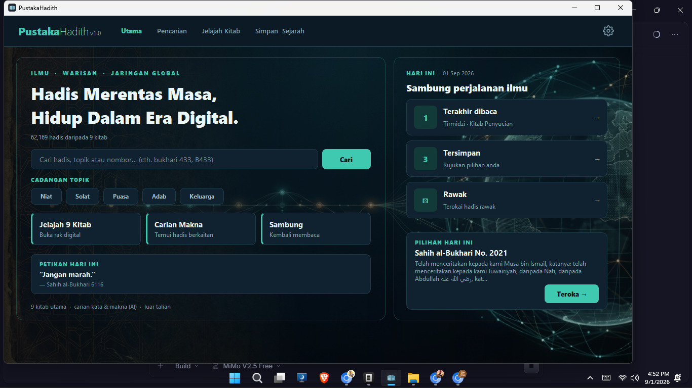
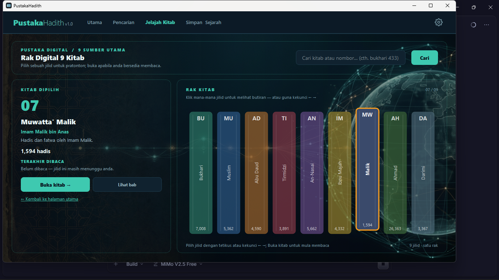
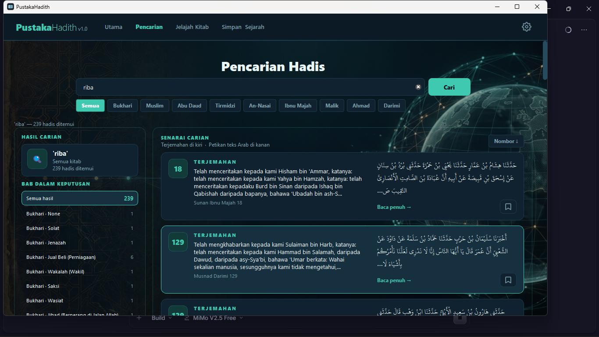
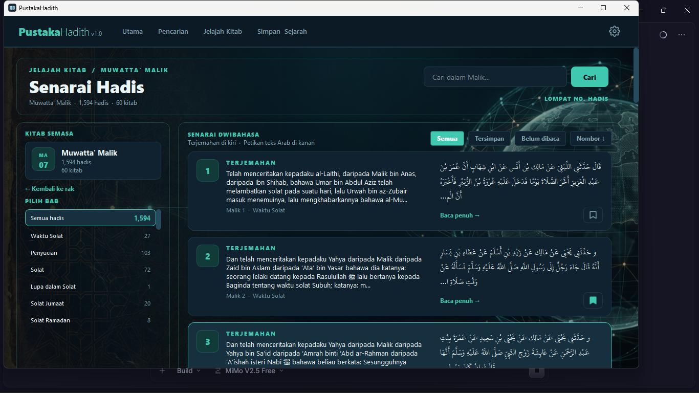
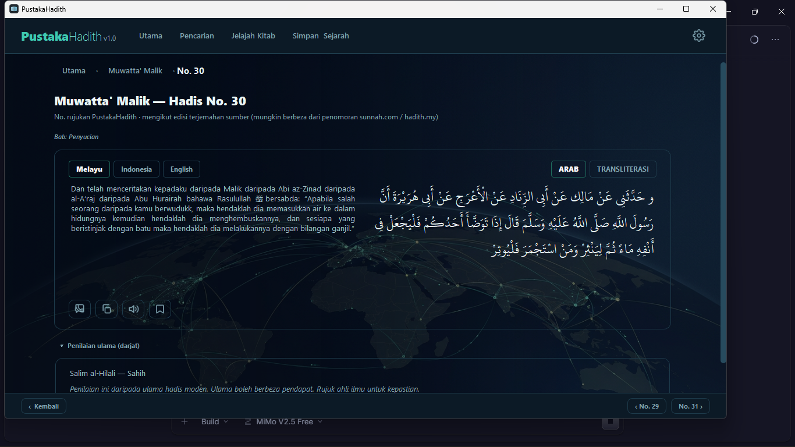
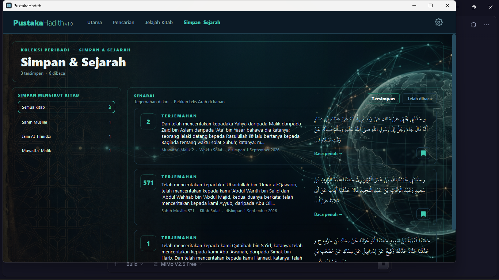

# Manual Penggunaan — PustakaHadith v1.0

> Panduan menggunakan aplikasi PustakaHadith.
> Bahasa: Melayu · Untuk pengguna aplikasi.
> Panduan pemasangan: lihat `dokumen/manual/MANUAL_INSTALASI.md`.

---

## Mengenai PustakaHadith

PustakaHadith ialah aplikasi membaca dan mencari hadis daripada
**9 kitab utama** (kutub al-tis'ah) — **62,169 hadis** dengan teks Arab
berbaris penuh, terjemahan Melayu & Indonesia, transliterasi, darjat
ulama, huraian ringkas, dan carian makna (AI).

| Kitab | Bilangan hadis |
|---|---|
| Sahih al-Bukhari | 7,008 |
| Sahih Muslim | 5,362 |
| Sunan Abu Daud | 4,590 |
| Jami' al-Tirmidzi | 3,891 |
| Sunan al-Nasa'i | 5,662 |
| Sunan Ibnu Majah | 4,332 |
| Musnad Ahmad | 26,363 |
| Sunan al-Darimi | 3,367 |
| Muwatta' Malik | 1,594 |

*(jumlah: 62,169 hadis. Nombor hadis mengikut **penomboran set data sumber**
(hadis.my / edisi terjemahan). Bagi sesetengah kitab, nombor ini mungkin
berbeza daripada penomboran buku cetak atau sunnah.com. Ia dipaparkan sebagai
**"No. rujukan PustakaHadith"** pada setiap butiran hadis (dan petua alat pada
senarai) supaya tidak keliru; rujukan dalam aplikasi kekal konsisten dengan
data yang dipaparkan.)*

---

## Skrin Utama

- **Bar carian** — di tengah skrin utama. Taip soalan atau kata kunci.
- **Senarai kitab** — 9 kitab utama; klik **Jelajah Kitab** (nav atas) untuk
  buka **Rak Digital**, kemudian pilih kitab untuk masuk ke halamannya
  (dengan senarai Bab di bar sisi).
- **Ikon gear (⚙)** — atas kanan: panel Tetapan.
- **Ikon bintang** — buka senarai penanda halaman anda.
- **Ikon dadu (⚄)** — hadis rawak.

**Rak Digital (Jelajah Kitab):** senarai 9 kitab utama dengan kiraan hadis
setiap koleksi.

---

## Mencari Hadis

### Carian kata kunci

1. Taip perkataan di bar carian (contoh: `puasa`, `zakat`, `niat`).
2. Hasil dipapar sebagai kad — klik kad untuk baca penuh.

Carian boleh ditapis ikut kitab melalui senarai pilihan di atas kotak
carian.

### Carian makna (AI)

Taip soalan penuh seperti:

- `hukum riba dalam islam`
- `kelebihan puasa ramadhan`
- `cara bertaubat dari dosa`

Aplikasi memadankan hadis **ikut maksud**, bukan sekadar perkataan
sama. Ia berguna apabila kata kunci anda berbeza daripada perkataan
tepat dalam teks hadis. Hasil carian makna dipapar di bawah hasil kata
kunci, dengan skor padanan.

### Lompat terus ke hadis

Taip nombor atau gabungan kitab+nombor di bar carian:

| Taip | Kesan |
|---|---|
| `433` | Buka hadis nombor 433 (carian automatik) |
| `bukhari 433` | Buka kitab Bukhari pada hadis 433 |
| `B433` / `b:433` | Sama seperti di atas |
| `Ctrl+G` | Kotak "Lompat No. hadis" pada halaman kitab |

### Meneroka mengikut Bab

Pada halaman sesebuah kitab, bar sisi kiri memaparkan **senarai Bab**
("PILIH BAB") yang dijana daripada data sumber. Klik mana-mana bab untuk
lompat terus ke hadis pertama bab tersebut. Ciri ini membantu navigasi
mengikut topik (cth. "Wuduk", "Solat") dan bukan nombor hadis semata-mata.

> Nota: senarai Bab tersedia untuk kebanyakan kitab; Musnad Ahmad dan
> Sunan al-Darimi tiada data bab dalam set data semasa.

---

## Membaca Hadis

Setiap hadis dipapar dalam **dua lajur**:

- **Kanan (lajur Arab):** teks Arab penuh dengan tab **Arab |
  Transliterasi** (dua gaya bacaan rumi).
- **Kiri (lajur terjemahan):** tab **Melayu | Indonesia | English**.

Di bawah teks:

- **Transliterasi (bacaan rumi)** — boleh kembang, di belakang tajuk
  klik.
- **Darjat ulama** — penilaian Sahih/Hasan/Da'if mengikut ulama
  (dipapar mentah tanpa tafsiran).
- **Huraian ringkas** — daripada SemakHadis.com (atribusi dipapar).
- **Syarah** — tambahan rujukan Arab.

### Bar tindakan di bawah terjemahan

| Butang | Fungsi |
|---|---|
| **Lapor ralat** | Buka halaman laporan di sunnah.com |
| **Kongsi** | Kongsi ke WhatsApp (ikut bahasa semasa) |
| **Salin** | Menu 3 pilihan: Arab sahaja / terjemahan semasa / Arab + terjemahan |
| **💬 WhatsApp** | Kongsi terus ke WhatsApp |
| **🔊 Dengar** | Baca teks dengan suara (TTS) |

**Navigasi:** butang **‹ No. sebelumnya** / **No. seterusnya ›** untuk
hadis jiran dalam kitab. **Kembali** untuk kembali ke senarai.

---

## Penanda Halaman (Bookmark)

1. Buka mana-mana hadis.
2. Klik ikon **bintang/Simpan** — hadis disimpan.
3. Buka senarai penanda halaman melalui ikon bintang di skrin utama.
4. Klik hadis untuk membuka semula; klik bintang sekali lagi untuk
   buang.

Penanda halaman disimpan dalam fail `bookmarks.json` di folder data
anda — kekal selepas aplikasi ditutup atau dikemas kini.

---

## Tetapan

Klik ikon **gear (⚙)** di penjuru atas kanan.

### Paparan

| Tetapan | Fungsi |
|---|---|
| **Tema** | Gelap / Terang / Neutral gelap / Neutral terang |
| **Fon Arab** | Pilih fon Arab yang sesuai |
| **Saiz Arab** | Saiz teks Arab |
| **Saiz terjemahan** | Saiz teks terjemahan |
| **Saiz antara muka** | Saiz keseluruhan aplikasi |
| **Hadis per halaman** | Bilangan kad dalam satu halaman senarai |

### Bacaan

| Tetapan | Fungsi |
|---|---|
| **Bahasa dimuat** | Bahasa terjemahan yang dimuat/disimpan |
| **Transliterasi** | Papar / sembunyikan bacaan rumi |

### Sambungan

| Tetapan | Fungsi |
|---|---|
| **Mod** | Paparan mod dalam talian / luar talian semasa |

---

## Keperluan Data & Mod Luar Talian

Binaan edaran rasmi (Setup EXE, Portable 7z, dan MSIX Store) **membundel
pangkalan data hadis lengkap** (`hadis.db`, ~62,169 hadis terjemahan Melayu)
terus dalam aplikasi. Sebab itu:

- Anda **terus boleh membaca dan mencari hadis tanpa internet** dan
  **tanpa sebarang kunci atau data tambahan** sebaik sahaja pemasangan
  selesai.
- Model carian makna AI (`intfloat/multilingual-e5-small`) juga **dibundel**
  — carian makna berjalan **setempat**, tiada data dihantar ke pelayan.
- Data yang disertakan ialah *snapshot* terjemahan `hadis.my` pada tarikh
  pakej dibina. Untuk mendapat terjemahan terbaru, muat turun versi
  aplikasi yang lebih baharu apabila tersedia.

---

## Petua

- Model carian makna dimuat pada kali pertama dibuka — jangan tutup
  aplikasi sebelum skrin pemula selesai (atau klik skrin pemula untuk
  melangkau).
- Untuk hasil carian terbaik, taip soalan penuh, bukan satu perkataan.
- Simpan hadis yang kerap dirujuk ke penanda halaman.
- Data anda selamat — nyahpasang tidak memadam folder data
  (`%LOCALAPPDATA%\PustakaHadith`).

---

## Masalah Lazim

| Masalah | Penyelesaian |
|---|---|
| Aplikasi lambat buka | Kali pertama sahaja; larian seterusnya laju. |
| Tiada hasil carian kata kunci | Cuba soalan penuh untuk carian makna (AI). |
| Tab English kelabu (Musnad Ahmad) | Terjemahan Inggeris Musnad Ahmad (Darussalam) tidak disertakan dalam binaan edaran buat masa ini — menunggu lesen. |
| Ralat sambungan | Semak internet; hadis yang dimuat masih boleh dicari. |

---

## Sumber dan Atribusi

- **Teks hadis, terjemahan Melayu & Indonesia:** hadis.my — Hadis
  Malaysia (https://hadis.my)
- **Darjat ulama:** koleksi `fawazahmed0/hadith-api` (domain awam),
  berasal daripada sunnah.com
- **Huraian ringkas:** SemakHadis.com — atribusi dipaparkan pada setiap
  huraian
- **Carian makna (AI):** model `intfloat/multilingual-e5-small` (berjalan
  setempat, luar talian)
- **Pembundelan data:** binaan edaran rasmi membundel *snapshot* terjemahan
  hadis.my (`hadis.db`) — rujuk seksyen "Keperluan Data & Mod Luar Talian";
  sumber asal: Hadis Malaysia (https://hadis.my)

---

*Dokumen: `dokumen/manual/MANUAL_PENGGUNAAN.md` · Untuk aplikasi PustakaHadith ·
Versi: 1.1 · 5 September 2026*