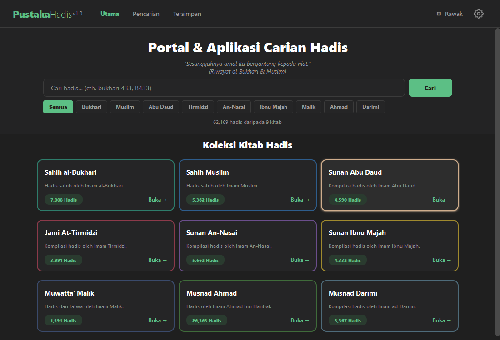
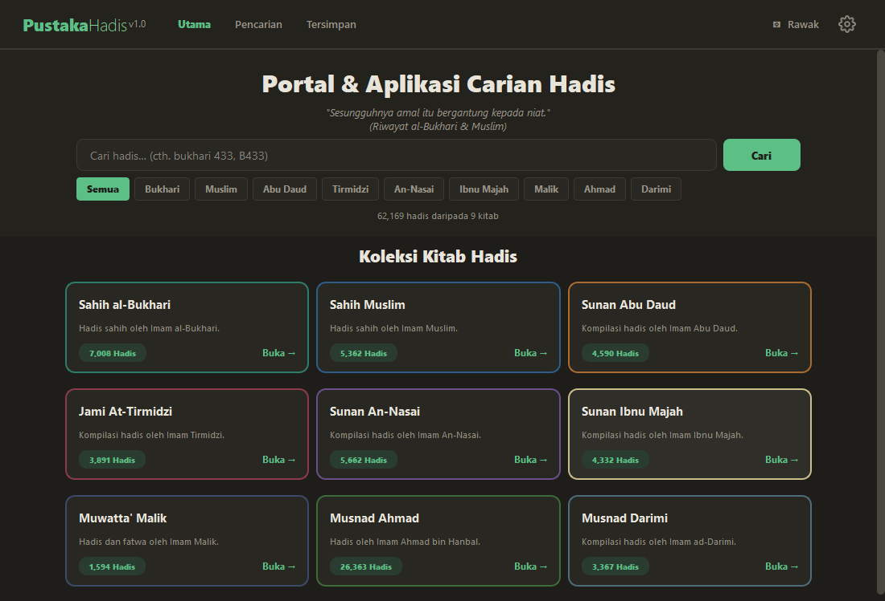
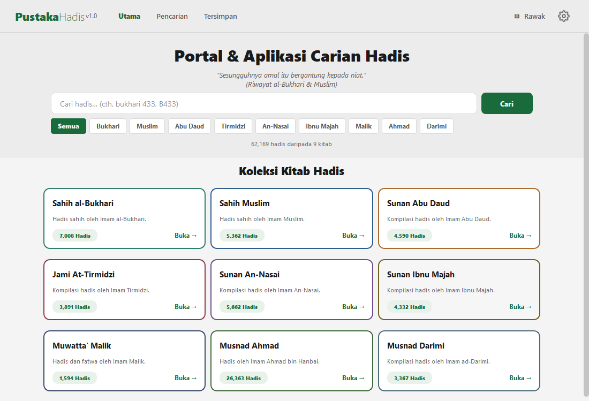
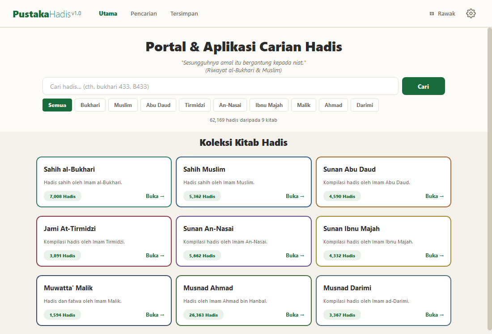
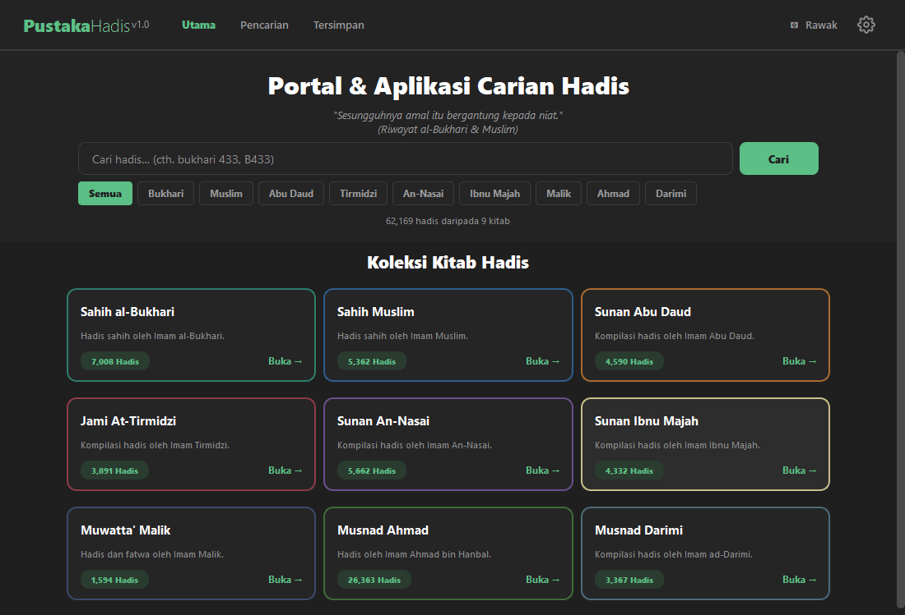
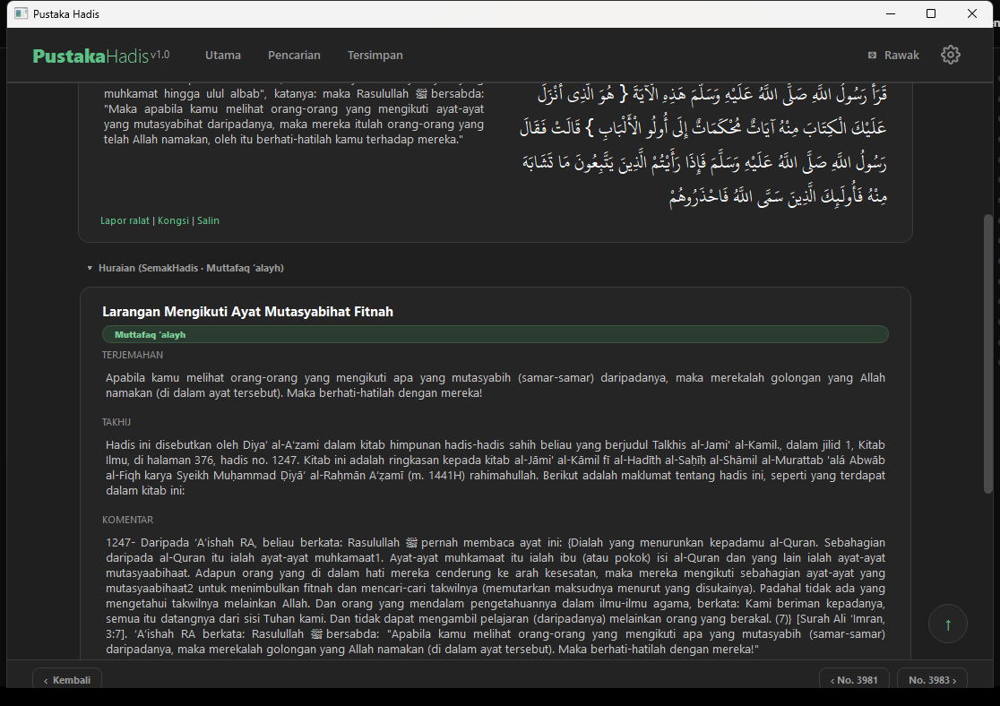
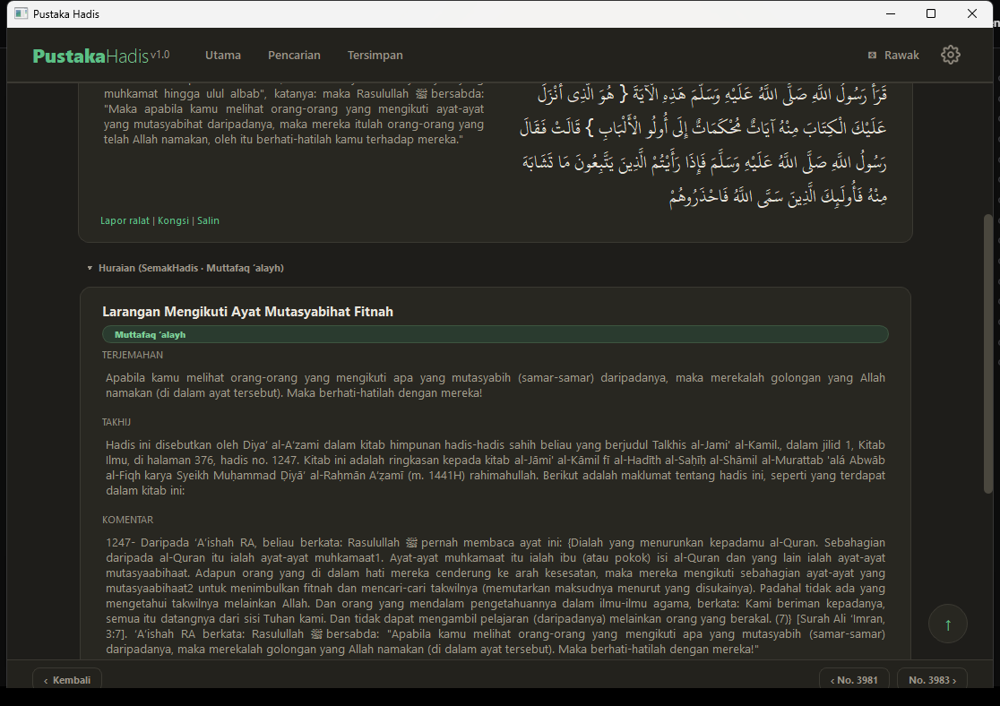
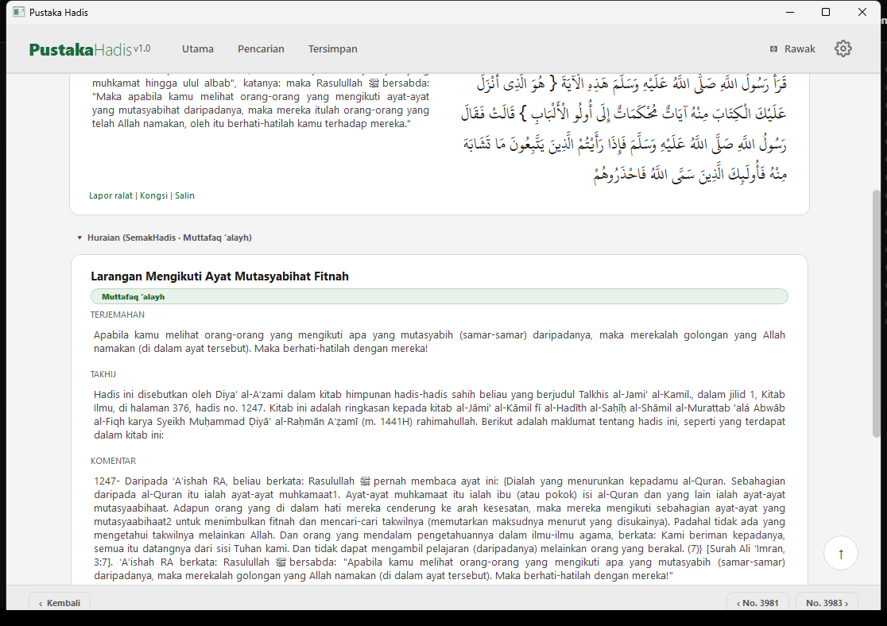
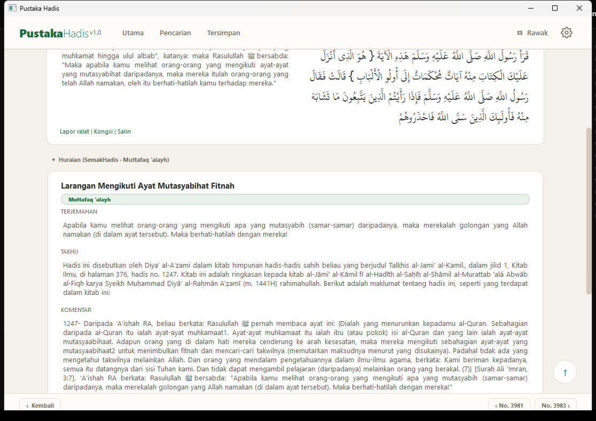

# Manual Penggunaan — Pustaka Hadis

> Panduan cara guna aplikasi: antara muka, membaca, carian, dan tetapan.
> Sesuai untuk pengguna akhir. Versi rujukan: **v1.0**.
>
> **Ciri v1.0:** skrin pemula (splash) · carian makna (AI) · lompat terus
> ke hadis (`bukhari 433`, `Ctrl+G`) · tab bahasa (Melayu/Indonesia/English) · indikator
> jam berputar semasa carian · 4 tema (terang · neutral terang · neutral · kertas) ·
> kongsi WhatsApp ikut bahasa semasa (terus format Ringkas: petikan Arab + terjemahan penuh + pautan Baca penuh)
>
> Manual pemasangan: `dokumen/manual/MANUAL_INSTALASI.md`.

---

## 1. Apa itu Pustaka Hadis

Aplikasi desktop Windows untuk membaca **9 kitab hadis utama** —
**62,169 hadis** keseluruhannya:

| # | Kitab | Slugin (nama lazim) |
|---|---|---|
| 1 | Sahih al-Bukhari | bukhari |
| 2 | Sahih Muslim | muslim |
| 3 | Sunan Abu Daud | abu-daud |
| 4 | Sunan al-Tirmizi | tirmidzi |
| 5 | Sunan al-Nasa'i | nasai |
| 6 | Sunan Ibnu Majah | ibnu-majah |
| 7 | Musnad Ahmad | ahmad |
| 8 | Sunan al-Darimi | darimi |
| 9 | Muwatta' Malik | malik |

Setiap hadis boleh dibaca dalam:

- **Arab** (teks asal, dengan harakat/tashkeel)
- **Melayu** — terjemahan rasmi hadis.my (ungkapan selawat kepada
  Rasulullah dipaparkan sebagai simbol ﷺ secara lalai)
- **Indonesia** — terjemahan hadis.my
- **Inggeris** — terjemahan daripada sumber CDN (7 kitab utama; Ahmad
  dan Darimi tiada terjemahan Inggeris)
- **Transliterasi (bacaan rumi)** — dua gaya: Melayu dan Akademik
  (selawat kepada Rasulullah turut dipaparkan sebagai simbol ﷺ)
- **Huraian SemakHadis** — penjelasan berbahasa Melayu untuk hadis popular
  (4,237 hadis; disumbangkan oleh SemakHadis.com) — terbuka di bahagian
  "Huraian (SemakHadis · status)" pada halaman hadis
- **Huraian HadeethEnc (sandaran)** — untuk hadis yang tiada huraian
  SemakHadis, aplikasi memaparkan huraian HadeethEnc (hadis sahih +
  penjelasan ringkas BM) dengan atribusi wajib ke HadeethEnc.com (projek
  IslamHouse)

Semua data disimpan **secara tempatan** dalam komputer anda (`hadis.db`).
Bacaan adalah luar talian selepas muat turun.

Selain carian perkataan biasa, aplikasi juga ada **Carian Makna (AI)**:
taip maksud dalam bahasa biasa dan aplikasi mencari hadis yang paling
relevan ikut **makna** (bukan sekadar padanan perkataan). Pada permulaan,
aplikasi memaparkan **skrin pemula (splash)** dengan bar kemajuan sambil
menyediakan model carian makna; klik untuk teruskan sebaik sahaja
"**Sedia! ✔**" muncul.

Pada larian pertama, aplikasi memaparkan **deklarasi** ringkas — apa
aplikasi ini dan apa ia BUKAN (sumber fatwa, alat semakan hadis palsu,
pengganti guru). Tekan **Faham** untuk teruskan; deklarasi tidak muncul
lagi pada larian seterusnya. Deklarasi penuh boleh dibuka semula dalam
Tetapan → Tentang.

---

## 2. Antara muka aplikasi

### Bar navigasi atas

| Butang | Fungsi |
|---|---|
| **Utama** | Skrin utama (senarai 9 kitab) |
| **Pencarian** | Cari hadis mengikut teks |
| **Tersimpan** | Senarai hadis yang anda tandakan |
| **⚄ Rawak** | Buka satu hadis secara rawak |
| **⚙ gear** | Panel Tetapan |

### Skrin utama

- Kotak **carian** di bahagian atas
- **9 kad kitab** — klik mana-mana kad untuk membuka kitab tersebut

### Membaca kitab

- Klik kad kitab → senarai hadis (20 hadis setiap halaman secara lalai;
  boleh ubah dalam Tetapan → BACAAN → Hadis per halaman)
- Butang **‹ Sebelum / Seterusnya ›** untuk menukar halaman
- Kotak **Lompat No. hadis** di atas senarai — taip nombor (cth. `433`)
  lalu tekan Enter untuk lompat terus ke hadis itu dalam kitab semasa;
  tekan **Ctrl+G** bila-bila masa untuk fokus ke kotak ini
- Senarai panjang? Butang **↑** muncul di sudut kanan-bawah apabila
  anda skrol ke bawah — klik untuk kembali ke hadis pertama dengan
  lancar
- Klik satu hadis untuk membaca penuh

### Halaman hadis

> **Sejarah paparan:** susun atur halaman ini diubah secara menyeluruh pada
> Sesi 55 (dua lajur, tab per lajur, darjat terbuka, palet kertas hangat) —
> perbandingan lama → baharu dengan tangkap layar ada dalam
> `dokumen/manual/TRANSFORMASI_DETAIL.md`.

Setiap hadis dipaparkan dalam **dua lajur sebelah-menyebelah**
(susunan RTL, 14 Ogos 2026):

- **Lajur kanan (Arab)** — teks Arab asal, dengan tab **ARAB |
  TRANSLITERASI** di atasnya (dijajarkan kanan, mengikut aliran RTL).
  Dalam teks Melayu, ungkapan selawat kepada Rasulullah dipaparkan
  sebagai simbol ﷺ secara lalai (boleh tukar ke bentuk penuh dalam
  Tetapan). Ini merangkumi bentuk rumi "Sallallahu 'alaihi wasallam",
  bentuk Arab tertanam "صلى الله عليه وسلم" dalam teks Melayu, dan
  transliterasi rumi (kedua-dua gaya: Melayu & Akademik)
- **Lajur kiri (terjemahan)** — tab bahasa **Melayu | Indonesia |
  English** (keputusan mockup Sesi 55; tab "Sebelah" bandingan
  dibuang). Teks terjemahan sentiasa **sama paras (top-aligned)**
  dengan teks Arab di lajur kanan, walau apa keadaan (kongsi
  WhatsApp tiada di sini — kongsi mengikut bahasa semasa sahaja)
- **Huraian (SemakHadis · status)** — penjelasan berbahasa Melayu untuk
  hadis popular (4,237 hadis) — terbuka secara automatik, dengan **cip
  klasifikasi berwarna ikut makna** (hijau = sahih/hasan, merah =
  palsu/munkar, amber = lemah/daif)
- **Huraian (HadeethEnc · status)** — sandaran untuk hadis yang tiada
  huraian SemakHadis (hadis sahih + penjelasan ringkas; atribusi wajib
  ke HadeethEnc.com / IslamHouse)
- **Penilaian ulama (darjat)** — terbuka secara automatik; memaparkan
  darjat secara mentah (baris "Nama — Darjat") dengan penafian ulama
  moden; hadis tanpa penilaian memaparkan mesej jujur

Butang tindakan:

| Butang | Fungsi |
|---|---|
| 💬 **WhatsApp** | Kongsi hadis melalui WhatsApp — ikut tab bahasa semasa, terus guna format **Ringkas**: petikan Arab ~10 baris + terjemahan penuh (kedua-duanya kelihatan; hadis panjang: "Read more" asli di hujung terjemahan) + pautan "Baca penuh" sunnah.com untuk buka hadis penuh di pelayar |
| 📋 **Salin** | Salin teks hadis (pilih bahasa dahulu; klik kanan juga boleh) |
| 🔊 **Dengar** | Dengarkan hadis (bacaan) |
| **☆ Simpan / ⭐ Tersimpan** | Tandakan hadis untuk dirujuk kemudian |

Klik kanan pada teks untuk menu tambahan (cth. "Salin semua").

Di bawah teks terjemahan, sudut kanan bawah, ada bar **teks** (bukan
butang) `Lapor ralat | Kongsi | Salin` (tiru sunnah.com):

- **Lapor ralat** — buka halaman sunnah.com hadis itu dalam pelayar
  untuk melaporkan ralat di sumber
- **Kongsi** — kongsi melalui WhatsApp (sama seperti butang 💬 WhatsApp)
- **Salin** — menu 3 pilihan: *Arab sahaja / terjemahan (bahasa semasa)
  / Arab + terjemahan semasa* (tanpa baris rujukan)

Jika kandungan hadis panjang (syarah, darjat, huraian), butang **↑**
muncul di sudut kanan-bawah apabila anda skrol ke bawah — klik untuk
kembali ke teks hadis dengan lancar.

### Sejarah paparan detail

Susun atur halaman hadis diubah secara menyeluruh pada **Sesi 55** (11–12
Ogos 2026) berdasarkan perbandingan 4 mockup reka bentuk. Ringkasan
lama → baharu:

| Aspek | LAMA (sebelum Sesi 55) | BARU (Sesi 55) |
|---|---|---|
| **Susun atur utama** | Satu lajur menegak: Arab di atas, terjemahan di bawah | **Dua lajur sebelah-menyebelah**: Arab di kanan, terjemahan di kiri pada baris yang sama (susunan RTL, 14 Ogos) |
| **Tab transliterasi** | Collapsible berasingan "Transliterasi (bacaan rumi)" di bawah kad Arab | **Tab ARAB / TRANSLITERASI** dalam lajur kanan; transliterasi dua gaya (GAYA MELAYU + AKADEMIK) |
| **Tab bahasa** | LangTabs global satu bar di atas kotak terjemahan | **Tab MELAYU / INDONESIA / ENGLISH** dalam lajur terjemahan |
| **Bahagian Huraian** | Collapsible terbuka (kekal) | Terbuka + **cip klasifikasi berwarna ikut makna** |
| **Penilaian ulama (darjat)** | Collapsible **tertutup** lalai (keputusan Sesi 14) | **Terbuka** lalai + papar mentah (baris "Nama — Darjat") + penafian ulama moden |
| **Cip warna ikut makna** | Tiada | Muttafaq 'alayh/Sahih/Hasan → **hijau**; Palsu/Munkar → **merah**; Lemah/Daif → **amber** |
| **Palet** | TEAL biru `#7FC4DE`, latar tidak kertas hangat | **Palet kertas hangat**: `#F4F1EA` (terang) / `#1E1D1A` (gelap), TEAL hijau `#5CBF85` |
| **Nama kitab** | Ejaan lama | Ejaan rasmi "Sahih al-Bukhari" + prefix **"Bab:"** pada baris bab |
| **Tindakan (WhatsApp/Salin/Dengar/Simpan)** | Di baris tajuk | Kekal di baris tajuk (baris yang sama, tidak lagi di bawah kad) |

Perbandingan penuh dengan **tangkap layar** (lama vs baharu, tema gelap +
terang) ada dalam `dokumen/manual/TRANSFORMASI_DETAIL.md`. Keputusan
lanjutan Sesi 55 (buang tab Sebelah, teks sama paras, lalai Arab Kecil,
pembetulan draf jawapan AI — 13 Ogos) direkod dalam
`dokumen/perubahan/PERUBAHAN_13OGOS.md`.

### Huraian SemakHadis (penjelasan)

- Hadis popular (4,237) dipaparkan dengan bahagian **Huraian (SemakHadis ·
  status)** yang terbuka — mengandungi tajuk, status hadis, terjemahan,
  takhrij, dan komentar berbahasa Melayu
- Sumber: **SemakHadis.com** — atribusi sentiasa dipaparkan
- Setiap huraian ada butang **Salin syarah penuh**
- **Sandaran HadeethEnc:** jika hadis tiada huraian SemakHadis, aplikasi
  cuba bahagian **Huraian (HadeethEnc · status)** — hadis sahih + penjelasan
  ringkas BM, dengan atribusi wajib ke HadeethEnc.com (projek IslamHouse)
- Baca juga: **syarah klasik Arab** (boleh kembang) dan **darjat** (terbuka secara automatik, papar mentah)

### Carian

- Klik **Pencarian** di navigasi
- Taip perkataan (Arab, Melayu, atau Indonesia)
- Hasil dipaparkan ikut kitab; guna **‹ Sebelum / Seterusnya ›** untuk
  halaman seterusnya
- **Lompat terus ke hadis:** taip nama kitab + nombor (cth. `bukhari
  433`, `abu daud 100`) lalu Enter — **butiran hadis itu dibuka terus**
  (carian khusus = satu sasaran sahaja, bukan senarai). Format lain
  turut diterima: `bukhari:433`, `B433`, atau nama ringkas kitab
  (`b 433`, `t 5` — selagi tidak keliru dengan kitab lain)
- **Nombor sahaja** (cth. `433`) juga **membuka butiran hadis** itu
  dalam kitab yang dipilih (chip) atau kitab terakhir dibuka — dari
  halaman Utama mahupun halaman Carian
- Carian **umum** (cth. `hukum riba`) tetap memaparkan **senarai hasil**
  carian seperti biasa — hanya carian khusus kitab + nombor yang terus
  ke butiran
- Carian menjalankan **dua enjin serentak**: kata kunci (padanan
  perkataan) dan **carian makna (AI)** — hasil gabungan dipaparkan,
  padanan makna dahulu
- Apabila carian makna ada padanan, **jawapan draf AI** dipaparkan di
  atas hasil — ringkasan maksud + rujukan hadis teratas untuk soalan anda
- Semasa carian berjalan, **jam berputar 🕐→🕛** ditunjukkan di baris
  status; ia hilang sebaik sahaja hasil siap (carian makna kali pertama
  boleh ambil beberapa saat kerana model perlu dimuatkan)
- Jika tiada hadis mengandungi SEMUA perkataan yang anda taip, aplikasi
  cuba padanan yang mengandungi mana-mana satu perkataan (carian longgar)
  dan memaparkan notis — hasil mungkin kurang tepat daripada padanan penuh
- Senarai hasil panjang? Butang **↑** muncul di sudut kanan-bawah apabila
  anda skrol ke bawah — klik untuk kembali ke atas hasil dengan lancar

### Tersimpan

- Semua hadis yang anda tandakan **⭐** terkumpul di sini
- Klik hadis untuk membuka semula
- Senarai panjang? Butang **↑** muncul di sudut kanan-bawah apabila
  anda skrol ke bawah — klik untuk kembali ke atas senarai dengan
  lancar

---

## 3. Panel Tetapan

Klik **⚙ gear** untuk membuka panel gelongsor dari kanan.

### TEMA

- **🌙 Neutral** — gelap neutral (lalai, 14 Ogos 2026) — gaya mod gelap
  Windows/telefon, kontras tertinggi, sesuai mata umum
- **📜 Kertas** — kertas hangat (identiti mushaf bercetak; lalai sebelum
  14 Ogos 2026)
- **☀ Neutral terang** — terang neutral (pasangan kepada Neutral:
  permukaan putih/kelabu tulen, teks hitam neutral, kontras sama tinggi)
- **☀ Terang** — terang kertas hangat (identiti mushaf)
- **🌓 Ikut sistem** — ikut mod Windows secara automatik: mod gelap
  Windows → 🌙 Neutral, mod terang → ☀ Neutral terang. App memantau
  tetapan Windows (registry `AppsUseLightTheme`) setiap 2 saat dan
  bertukar hampir serta-merta bila Windows bertukar mod

#### Rujukan visual (5 tema)

Semua tangkapan skrin di bawah ialah halaman yang sama (Utama + Detail
hadis) untuk perbandingan adil. Semua tema ≥ WCAG AA (kontras ≥ 4.5:1).

Halaman Utama:

| 🌙 Neutral (lalai) | 📜 Kertas | ☀ Neutral terang | ☀ Terang | 🌓 Ikut sistem |
|---|---|---|---|---|
|  |  |  |  |  |

Halaman Detail:

| 🌙 Neutral (lalai) | 📜 Kertas | ☀ Neutral terang | ☀ Terang | 🌓 Ikut sistem |
|---|---|---|---|---|
|  |  |  |  |  |

### PAPARAN

- **Saiz antara muka** — saiz elemen UI (lalai: **Sederhana**)
- **Saiz teks Arab** — besar/kecil teks Arab (lalai: **Kecil** — Sesi 55,
  susun atur dua lajur supaya terjemahan sama paras dengan teks Arab)
- **Saiz terjemahan** — besar/kecil teks terjemahan (lalai: **Sederhana**)
- **Fon Arab** — pilih fon untuk teks Arab

### BACAAN

- **Bahasa dimuat** — Semua bahasa (lalai) / Melayu sahaja / Indonesia
  sahaja (pilihan penjimatan data)
- **Selawat** — Simbol ﷺ (lalai, jika fon ada glif) atau bentuk penuh
  "Sallallahu 'alaihi wasallam" — digunakan pada semua paparan: teks
  Melayu, bentuk Arab tertanam, dan transliterasi rumi
- **Hadis per halaman** — 10/20/30/50/100 (lalai: 20)

### SAMBUNGAN

- **Tetapan API** — masukkan/kemaskini kunci API (lihat Manual Instalasi,
  bahagian 4)

### TENTANG

- **Tentang Pustaka Hadis** — buka deklarasi penuh: tujuan, kandungan,
  sumber & atribusi, batasan, dan sokongan
