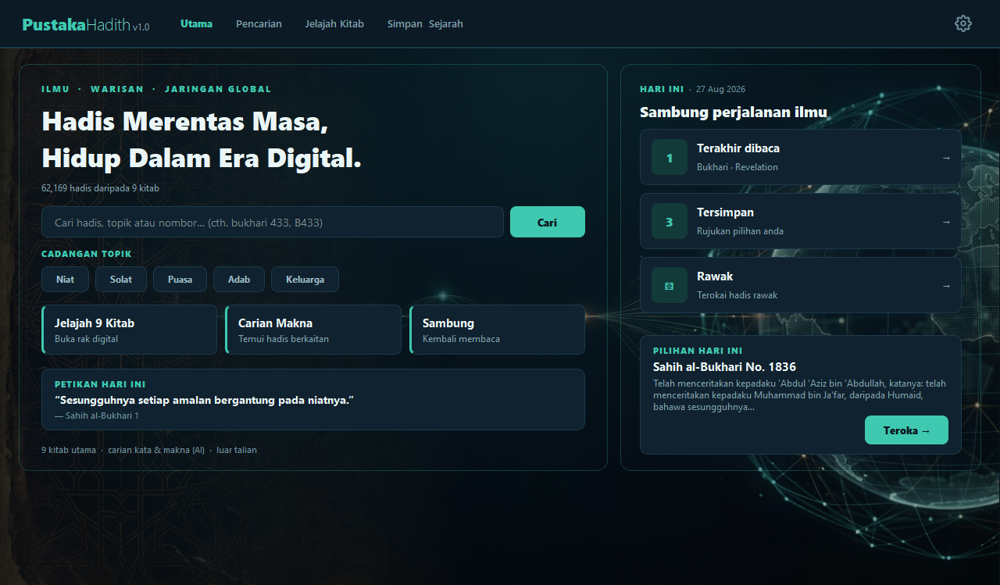
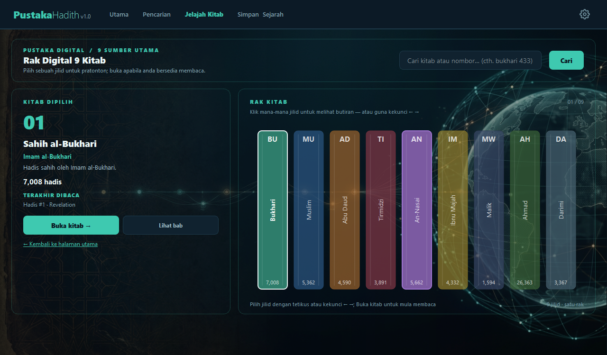
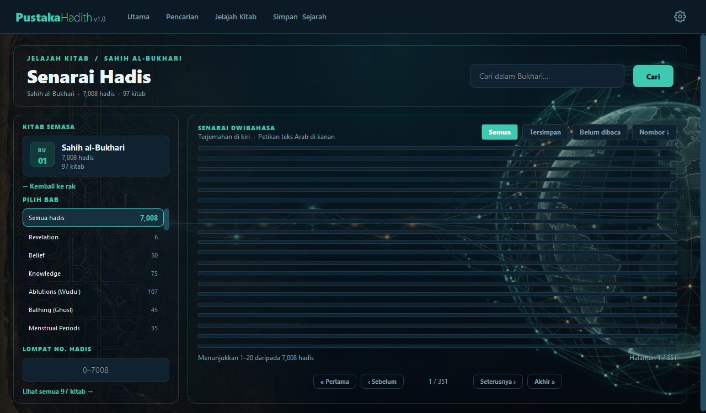
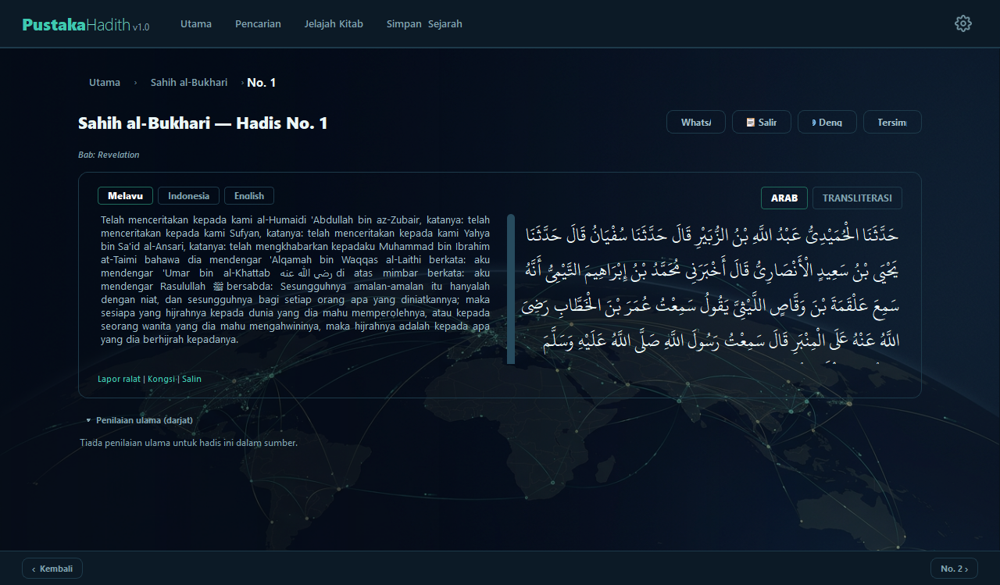
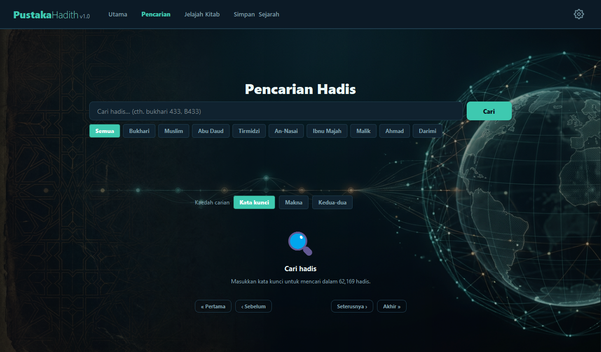
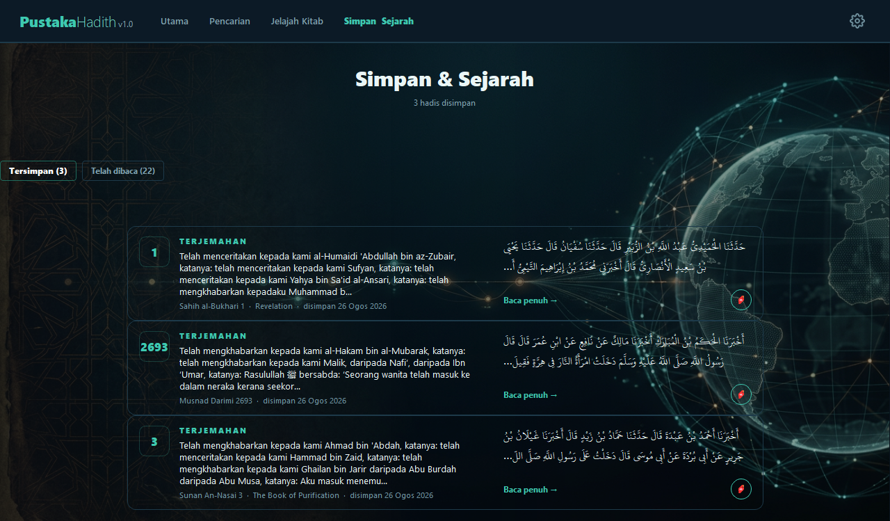

# Surat Permohonan Kebenaran / Pengesahan Penggunaan API — hadis.my (API Hadis Malaysia)

**Kepada:** Pengurus / Tim Teknikal hadis.my (Dayabumi Creative Network)  
**Dari:** Pembangun PustakaHadith  
**Tarikh:** 27 Ogos 2026  
**Perihal:** Pengesahan Penggunaan **API Hadis Malaysia (service.hadis.my)** dan Permohonan Kebenaran **Membundel Snapshot Data** untuk Aplikasi PustakaHadith v1.0

---

## ⚠️ Penjelasan Penting: hadis.my vs hadith.my

| Platform | Diguna Kita? | Butiran |
|---|---|---|
| **hadis.my / service.hadis.my** | ✅ **YA — Sumber Utama** | API rasmi: `https://service.hadis.my/api/v1` — 62,169 hadis, 9 kitab (termasuk Ahmad & Darimi), Bahasa Arab + Melayu + Indonesia, pelan percuma |
| **hadith.my** | ❌ **TIDAK** | Laman web English sahaja, tiada Ahmad/Darimi, "All rights reserved", tiada API, sekat AI bots. Kita **tidak scrape, tidak bundle, tidak papar** data darinya. |

**Surat ini hanya untuk hadis.my (API).**

---

## Salam Sejahtera,

Saya menulis untuk **mengesahkan dan memohon kebenaran rasmi** penggunaan **API Hadis Malaysia (https://hadis.my / https://service.hadis.my)** dalam aplikasi desktop **PustakaHadith** versi 1.0 yang akan diedarkan melalui Microsoft Store dan saluran lain.

### Latar Belakang Aplikasi

**PustakaHadith** adalah aplikasi desktop sumber terbuka (MIT License) untuk Windows 10/11 yang menyediakan:
- **62,169 hadis** daripada 9 kitab utama (Kutub al-Tis'ah) — **termasuk Musnad Ahmad (26,363) & Sunan Darimi (3,367)**
- Carian kata kunci (FTS5 SQLite) + carian makna AI (semantic search, on-device, model `intfloat/multilingual-e5-small`)
- Terjemahan **Melayu & Indonesia** (bersumber daripada hadis.my API)
- Transliterasi Arab (dua gaya rumi), Darjat ulama, Huraian ringkas (SemakHadis.com — permohonan berasingan)
- **Mod luar talian penuh** — data hadis disimpan tempatan dalam SQLite (`hadis.db`)
- Percuma, tiada iklan, tiada pengumpulan data peribadi, tiada telemetri

### Butiran Penggunaan API hadis.my (Semasa)

| Aspek | Butiran |
|---|---|
| **Endpoint** | `https://service.hadis.my/api/v1` (API v1 rasmi) |
| **Koleksi** | 9 kitab: bukhari (7,008), muslim (5,362), abu-daud (4,590), tirmidzi (3,891), nasai (5,662), ibnu-majah (4,332), ahmad (26,363), malik (1,594), darimi (3,367) = **62,169 hadis** |
| **Bahasa** | Arab (asal), Melayu, Indonesia |
| **Autentikasi** | Header `X-API-Key` (kunci peribadi pengguna) |
| **Kaedah akses** | Pengguna daftar akaun di `developer.hadis.my` → dapatkan kunci API → masukkan ke aplikasi → klik "Sync" |
| **Kekerapan** | **Sekali sahaja** (sync awal) atau bila pengguna pilih "Sync Semula" — **bukan automatik/berterusan** |
| **Kuota dihormati** | 200 permintaan/hari (Basic) / 1,000 (Personal) / 10,000 (Developer) — aplikasi **tidak melebihi** had ini |
| **Penyimpanan** | Data disimpan **hanya di peranti pengguna** (`%LOCALAPPDATA%\PustakaHadith\hadis.db`) — **tidak dikongsi/dikumpul ke server kami** |

### Aliran Kerja (User Flow) Semasa

```
1. Pengguna daftar akaun di https://developer.hadis.my → dapatkan Kunci API
2. Buka PustakaHadith → Tetapan → Masukkan Kunci API
3. Klik "Uji" → Aplikasi sahkan kunci dengan hadis.my (1 request)
4. Klik "Sync" → Aplikasi muat turun 62,169 hadis (batch requests, throttle 1.1s)
   → 622 permintaan API per pengguna untuk sync penuh
5. Data disimpan dalam SQLite tempatan → Aplikasi berfungsi LUAR TALIAN sepenuhnya
6. Tiada sambungan internet diperlukan untuk carian/bacaan berikutnya
```

### ⚠️ Masalah: Portal Pembangun vs Pengguna Awam

**developer.hadis.my ialah portal PEMBANGUN.** Pengguna sasaran kami orang awam yang ingin membaca hadis — mereka **tidak biasa** dengan konsep kunci API, dan ramai berhenti pada langkah ini sebelum sempat menggunakan aplikasi.

**Kunci terbenam BUKAN penyelesaian** (matematiknya tidak menjadi):
- Sync penuh = **622 permintaan** per pengguna
- Pelan Developer = 10,000/hari → hanya **~16 pengguna sehari**
- Jika 100 orang memasang pada hari yang sama, kuota habis pada pengguna ke-17. Selebihnya nampak aplikasi rosak.

---

## Permohonan Utama: Kebenaran Membundel Snapshot Data

Saya memohon kebenaran untuk **membundel snapshot data hadis.my** ke dalam pemasang aplikasi (MSIX/EXE/ZIP), supaya:

1. ✅ Pengguna **memasang dan terus membaca** tanpa kunci API dan tanpa sebarang permintaan ke pelayan tuan
2. ✅ **Mengurangkan beban infrastruktur hadis.my** berbanding keadaan sekarang (0 request vs 622/user)
3. ✅ Mengurangkan kerumitan pengguna awam (tiada daftar akaun, tiada kunci API, tiada tunggu sync 12 minit)

### Atribusi (Sudah Dilaksanakan Dalam Aplikasi)

| Lokasi | Teks Atribusi |
|---|---|
| **Skrin Utama** | "Data hadis bersumber daripada hadis.my — API Hadis Malaysia" |
| **Butiran Hadis** | "Sumber: hadis.my" (di bawah teks hadis) |
| **Manual Penggunaan** | Seksyen "Sumber dan Atribusi" — rujukan penuh ke https://hadis.my |
| **Dasar Privasi** | Dinyatakan sambungan hanya ke hadis.my untuk sync data |

### Syarat Kami Bersedia Mematuhi

1. ✅ **Atribusi jelas** — "Sumber data: hadis.my" pada skrin utama, halaman Tentang, setiap hadis jika dikehendaki
2. ✅ **Pautan ke developer.hadis.my** dalam aplikasi, menggalakkan pembangun lain menggunakan API tuan
3. ✅ **Kekerapan kemas kini snapshot** mengikut kebenaran tuan (contoh: bulan / 6 bulan / tahunan)
4. ✅ **Tiada pengedaran semula** dalam bentuk lain — tiada API pesaing, tiada muat turun data mentah, tiada penggunaan komersial
5. ✅ **Menarik balik sepenuhnya** jika diminta pada bila-bila masa
6. ✅ **Tiada ubahsuai data** — teks Arab, terjemahan Melayu, Indonesia dipaparkan sebagaimana daripada API

---

## Alternatif Jika Bundel Tidak Dibenarkan

Saya terbuka kepada:

| Alternatif | Implikasi |
|---|---|
| **Kunci khas kuota tinggi** (Developer 10K/hari atau lebih) untuk aplikasi ini | Sync automatik; risiko kuota habis jika popular |
| **Kekalkan cara semasa** | Saya akan memperbaiki panduan pendaftaran dalam aplikasi supaya lebih mudah diikuti orang awam |

---

## Maklumat Tambahan: 55 Hadis Terjemahan Melayu Tidak Lengkap

Semasa membina aplikasi, saya menjalankan imbasan penuh ke atas 62,169 hadis dan menemui **55 hadis (0.09%)** di mana sanad diterjemah tetapi **matn kekal dalam Arab**. Teks Indonesia bagi kesemuanya lengkap.

Ini **bukan data hilang** — kualiti terjemahan hadis.my sebenarnya sangat tinggi (99.91% lengkap). Saya sertakan senarai ID penuh di bawah dengan harapan ia berguna untuk pihak tuan membaiki sumber:

```
malik      : 36, 108, 109, 152, 153, 181, 190, 341, 522, 552, 556,
             572, 619, 647, 685, 701, 775, 779, 799, 806, 809, 828,
             881, 1082, 1418, 1513
bukhari    : 3459, 3477, 4413, 4604, 4935, 6236, 6990
tirmidzi   : 231, 1341, 1419, 1922, 2175, 2711, 2863, 2877, 3029,
             3031, 3073, 3116, 3120, 3270
ahmad      : 4303, 9358, 10614, 24278
darimi     : 91, 478, 2133, 2608
nasai      : 468
```
*(Nota: 25 kes lain = petikan ayat al-Quran sengaja dikekalkan Arab — betul, tidak disenaraikan.)*

---

## Maklumat Teknikal Aplikasi

| Item | Butiran |
|---|---|
| **Nama aplikasi** | PustakaHadith |
| **Versi** | 1.0.0 |
| **Platform** | Windows 10/11 (x64) |
| **Format edaran** | MSIX (Microsoft Store), EXE (Inno Setup per-user), ZIP portable |
| **Pangkalan data** | SQLite (`hadis.db`) — 62,169 rekod, FTS5 + indeks vektor FAISS (62,169 vektor, dimensi 384) |
| **Model AI** | `intfloat/multilingual-e5-small` (bundled, on-device inference, ~460 MB) |
| **Repositori** | https://github.com/PustakaHadith/PustakaHadith |
| **Lesen kod** | MIT License |

---

## Status Semasa (27 Ogos 2026)

- Aplikasi sudah siap dibina (MSIX + Setup EXE) untuk edaran Microsoft Store.
- **Buat masa ini binaan awam TIDAK membundel `hadis.db`** — pengguna memperoleh
  data melalui kunci API mereka sendiri (sync dari `service.hadis.my`). Ini langkah
  sementara **menunggu kebenaran bertulis** dari hadis.my (surat ini).
- Sebaik kebenaran diterima, snapshot data akan dibundel supaya pengguna boleh
  terus membaca tanpa kunci API (terperinci dalam "Permohonan Utama" di atas).
- **Penomoran No. Hadis:** nombor yang dipaparkan mengikuti *edisi terjemahan*
  sumber (Kutub al-Tis'ah) dan **tidak semestinya sepadan** dengan penomoran
  sunnah.com / hadith.my. Ia dilabelkan jelas sebagai "No. rujukan PustakaHadith"
  pada setiap butiran hadis (dan petua alat pada senarai) supaya pengguna tidak
  keliru; kandungan hadis tetap sahih.

## Tangkapan Skrin Aplikasi (v1.0.0 — Tema Aqua)

Berikut tangkapan skrin sebenar dari aplikasi yang berjalan, supaya pihak hadis.my
melihat rupa dan aliran penggunaan. Setiap paparan memaparkan atribusi "hadis.my".

**1. Skrin Utama (Perpustakaan)**  
  
Halaman selamat datang dengan akses pantas ke kitab, carian dan profil pembaca;
atribusi "Data hadis bersumber daripada hadis.my" dipaparkan di bahagian bawah.

**2. Rak Digital (Jelajah Kitab)**  
  
Senarai 9 kitab utama (Kutub al-Tis'ah) dengan kiraan hadis setiap koleksi.

**3. Halaman Kitab — Bukhari (bar sisi senarai Bab)**  
  
Bar sisi kiri memaparkan pemetaan bab ("PILIH BAB") yang dijana dari data hadis.my;
pengguna boleh lompat ke bab tertentu.

**4. Butiran Hadis — Bukhari #1**  
  
Teks Arab, terjemahan Melayu & Indonesia, darjat, dan atribusi "Sumber: hadis.my".
Bar sisi kiri menyediakan "Lompat No. hadis" dan pemetaan.

**5. Carian**  
  
Carian kata kunci (FTS5) dan carian makna AI (on-device, tanpa internet).

**6. Simpan & Sejarah**  
  
Penanda buku dan sejarah bacaan pengguna (disimpan hanya dalam peranti).

> Nota: Tangkapan diambil dari binaan pembangunan (Windows 10/11, 1280×749).
> Tiada data peribadi dipaparkan; halaman menggunakan data sampel awam.

## Lampiran (Disertakan Bersama Surat Ini)

1. **Tangkapan skrin** — 6 imej dalam `dokumen/penerbitan/tangkapan/`
   (`01_utama.png` … `06_simpan_sejarah.png`); lihat seksyen di atas.
2. **Dasar Privasi** — `dokumen/surat/sokongan/DASAR_PRIVASI.md`
3. **Pautan Sokongan** — `dokumen/surat/sokongan/PAUTAN_SOKONGAN.md`
4. **Manual Penggunaan** — `dokumen/manual/MANUAL_PENGGUNAAN.md`
5. **Skema pangkalan data** (jadual `hadis`, `kitab`, `bab`, `darjat`)
6. **Senarai 55 hadis** terjemahan Melayu tidak lengkap (CSV/JSON)

---

## Maklumat Hubungan

| Butiran | Maklumat |
|---|---|
| **E-mel rasmi (MSIX/Store)** | [pustaka.hadith@outlook.com] |
| **E-mel (Umum)** | [PustakaHadith@gmail.com] |
| **E-mel (Backup)** | [pustaka.hadith@proton.me] |
| **GitHub Issues** | https://github.com/PustakaHadith/PustakaHadith/issues |
| **Pembangun utama** | **opencodemk** |
| **Kontak hadis.my** | hadisapi@gmail.com (kuota/kelulusan), khai@webmaster.my (cc), WhatsApp +60 19-209 2006 |

---

## Sebelum Menghantar (Checklist)

- [ ] Isi butiran sebenar: `[NAMA]`, `[E-MEL]`, `[TELEFON]`
- [ ] Sertakan 6 tangkapan skrin (folder `dokumen/penerbitan/tangkapan/`)
- [ ] Sahkan atribusi "hadis.my" memang wujud di skrin utama & butiran hadis
- [ ] Nada: meminta izin, bukan menuntut hak (semua pelan percuma)
- [ ] Lampiran 55 ID hadis — menunjukkan niat baik, memberi nilai balik
- [ ] Simpan balasan sebagai bukti kebenaran untuk Microsoft Store (Gate 6)

---

Kami menghargai usaha **Dayabumi Creative Network (En. Khai)** menyediakan API Hadis Malaysia secara percuma untuk khidmat umat. Aplikasi ini dibina dengan niat ikhlas untuk memudahkan akses ke ilmu hadis yang sah dan berwibawa. Kebenaran dan pengesahan tuan/puan amat bermakna untuk memastikan kelangsungan projek ini.

Sekian, terima kasih.

---

**Yang benar,**

**opencodemk**  
Pembangun Utama, PustakaHadith  
E-mel (MSIX/Store): [pustaka.hadith@outlook.com]  
E-mel (Umum): [PustakaHadith@gmail.com]  
E-mel (Backup): [pustaka.hadith@proton.me]  
GitHub: https://github.com/PustakaHadith/PustakaHadith

---

*Surat ini boleh disahkan keasliannya melalui repositori GitHub rasmi projek.*